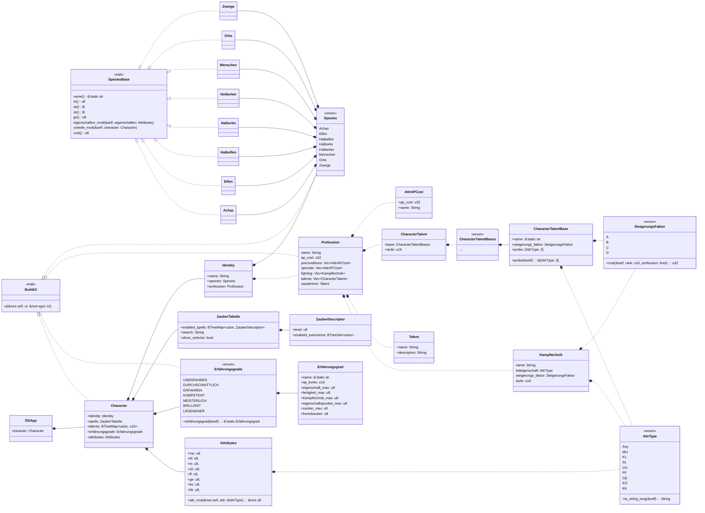

# DSApp – DSA Character Sheet

Das Ziel dieses Projektes ist ein digitales Character Sheet für DSA5 zu erstellen.

DSA5 ist eine Pen and Paper von Ulisess Spiele und stellt das deutsche Gegenstück zu DnD da.
Es gibt ein Programm um digital DSA5 Charaktere zu erstellen, dieses hat aber Probleme mit der Aktualität und bietet bei Anwendung eigner Regeln eine schlechte Implentierung zum Einfügen eigner Inhalte.

DSA5 bietet Möglichkeiten das Projekt stark zu erweitern, aber als erstes wollen wir die Charaktererstellung digitalisieren.

Beispiel DSA5 Chartaktersheet:
- [1 / Main](/image/char_sheet_1.png)
- [2 / Talente](/image/char_sheet_2.png)
- [3 / Kampf](/image/char_sheet_3.png)
- [4 / Ausrüstung](/image/char_sheet_4.png)
- [5 / Zauberer](/image/char_sheet_5.png)
- [6 / Geweihter](/image/char_sheet_6.png)

## Online Version
[DSApp](https://f3l1xqu1ll.github.io/DSApp/)

## To Do's:
### Phasen:
1. Phase: Bis Klausur (Milestone: Projektabgabe)
2. Phase: Einbindung der DSA Standarttypen 
3. Phase: Homebrew und mehr

### Projekt:
| Status | ToDo | notes |
|---|---|---|
| done | Einarbeiten | Julian |
| in progress | Dokumentation | | 
| done | Issues | |
| done | time table | zur Abgabe fertig; Länge |

### Erstellen eines Charakters
| Status | ToDo | notes | phase|
|---|---|---|---|
| done | Persönlichkeitsdaten | Familie| 1 |
| done | Erfahungsgrad / Abenteuerpunkte(AP) | check data| 1 |
| done | Spezies / Kultur | Boni/Mali(kann später)| 1 |
| done | Professionen | | 1 |
| done | Sprachen / Schriften || 1 |
| done | Leiteigenschaften | check data | 1 |
| done | Vorteile / Nachteile || 1 |
| done | Sonderfertigkeiten | in Profession | 1 |
| done | Grundwerte (LE, AsP, KP, SK, ZK, As) | Wert ausrechenen, Zukauf ermöglichen| 1 |
| done | Talente | Untertalente; check data | 1 |
| done | Kampftechniken | | 1 |
| not | Ausrüstung / Geld || 2 |
| not | Tragekraft || 2 |
| not | Tiere / Begleiter|| 2|
| not | Un-/Geeignete Vor-/Nachteile| Profession/Spezies/Kultur| 2 |
| not | Homebrew | done: professionen | 2 |
### Dynamisches Nutzen des Charakters
| Status | ToDo | phase|
|---|---|---|
| not | Statuseffekte | 2 | 
| in progress | Speichern von Char | 2 |
| not | Speichern von Homebrew | 3 |
| done | würfeln | 1 |
### weiters
| Status | ToDo | notes | phase |
|---|---|---|---|
| done | GUI | chapter| 1/2 |
| not | Programm | | 3 |
| not | Zonen Rüstung | | 3 |
| not | Verweis zu Ulisses-Wiki| | 2 |
| not | einheitliche Benennung| | 1-3|

## Projekt UML (Ausschnitt)

## Implementierung

(Fast) 100% Rust. App wird als WASM binary compiliert.

Interface wird mit `egui`, `eframe` (und derzeit WebGL über `wgpu`) gerendert.

Alle internen Ressourcen, wie Standartwerte, Regeln, etc. sind in Code umgesetzt.

Die Daten wurde aus [DSAwiki](https://ulisses-regelwiki.de/start.html) gewonnen
